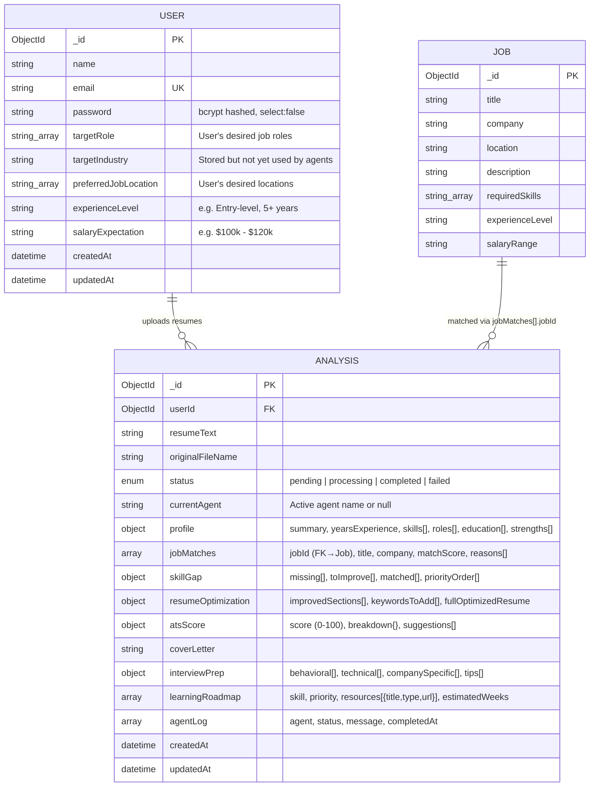
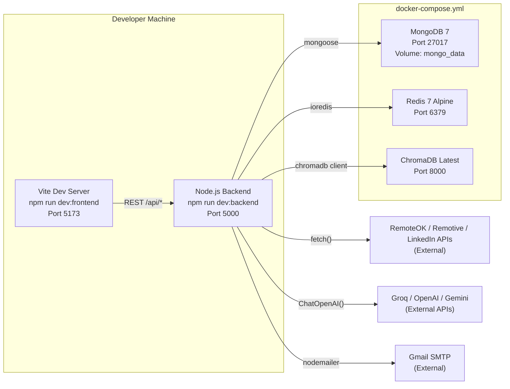
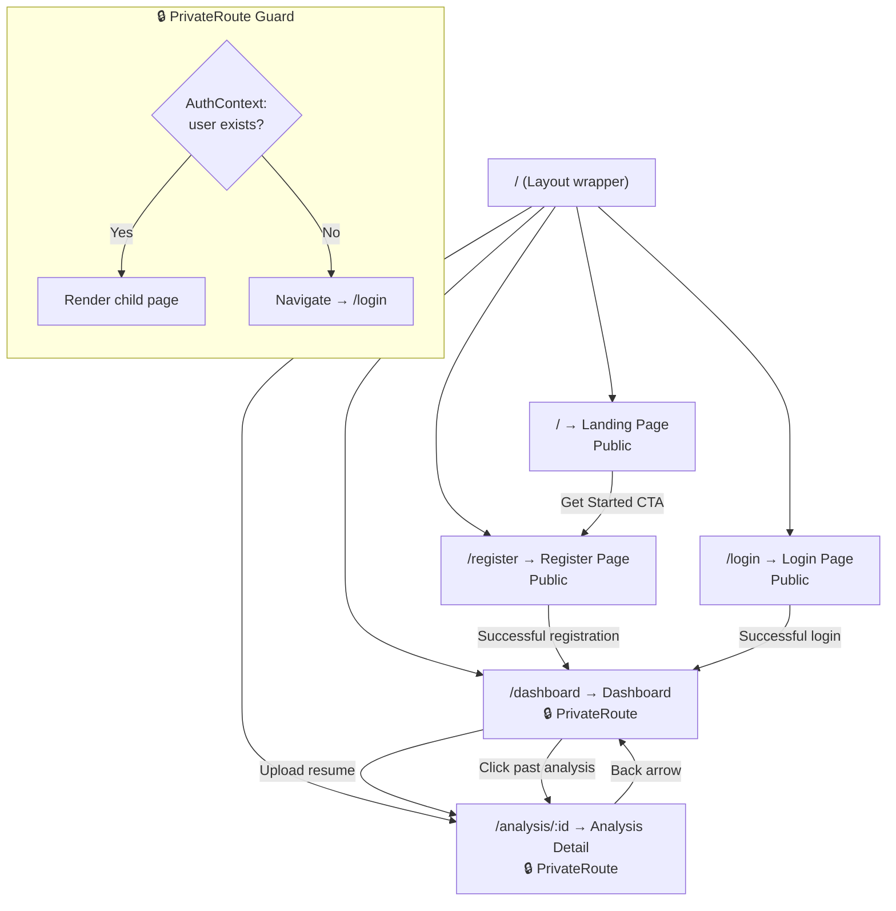
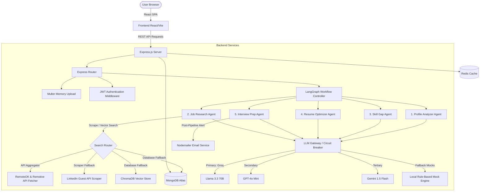

# AI Career Copilot 🚀

AI Career Copilot is a state-of-the-art, full-stack career guidance and job matching platform. At its core, the system orchestrates a sophisticated **LangGraph multi-agent pipeline** that ingests resumes, analyzes candidates' professional profiles, searches for real-time jobs on LinkedIn, performs skill gap analyses, provides ATS score assessments, suggests resume optimizations, drafts personalized cover letters, generates tailored interview prep material, and drafts visual learning roadmaps.

---

## 📐 High-Level Design (HLD) — How the Whole System Works

This section provides a complete top-to-bottom view of how every component in the system talks to every other component, what happens at each step, and how data flows from the moment a user opens the browser to the final email notification landing in their inbox.

---

### 1. System Overview & Component Map

The platform is divided into **3 tiers** connected over HTTP REST:

```
┌──────────────────────────────────────────────────────────────────────────────────┐
│                              TIER 1 — CLIENT                                    │
│                                                                                  │
│   React SPA (Vite)  ←→  React Router  ←→  AuthContext (JWT in localStorage)     │
│   Pages: Landing │ Register │ Login │ Dashboard │ AnalysisDetail                │
│   Components: Layout │ ResumeUpload │ AgentPipeline                             │
│   HTTP Client: Axios (base: /api, interceptors attach Bearer token)             │
└──────────────────────────────┬───────────────────────────────────────────────────┘
                               │  REST API (JSON + Multipart)
                               ▼
┌──────────────────────────────────────────────────────────────────────────────────┐
│                          TIER 2 — APPLICATION SERVER                            │
│                                                                                  │
│   Express.js (Port 5000)                                                        │
│   ├── Security: Helmet (HTTP headers) + CORS + Rate Limiter (200 req/15min)     │
│   ├── Auth Middleware: JWT verify → attach req.user                              │
│   ├── Routes: /api/auth/* │ /api/analysis/* │ /api/jobs │ /api/health            │
│   ├── File Upload: Multer (memory storage, 5MB limit, PDF/TXT only)             │
│   ├── Validation: Zod schemas on registration/login                             │
│   └── Services:                                                                 │
│       ├── LangGraph Pipeline (5 sequential agents)                              │
│       ├── LLM Gateway (Groq → OpenAI → Gemini → Local Mocks)                   │
│       ├── External Job APIs (RemoteOK, Remotive)                                │
│       ├── LinkedIn Scraper (Guest API, regex HTML parsing)                       │
│       ├── Resume Parser (pdf-parse for PDF, Buffer.toString for TXT)            │
│       ├── Vector Store (ChromaDB client)                                        │
│       └── Email Service (Nodemailer SMTP or local HTML file fallback)           │
└────────────┬─────────────────┬───────────────┬──────────────────────────────────┘
             │                 │               │
             ▼                 ▼               ▼
┌────────────────┐  ┌──────────────┐  ┌──────────────────┐
│  TIER 3 — DATA │  │   CACHING    │  │  VECTOR SEARCH   │
│                │  │              │  │                  │
│  MongoDB 7     │  │  Redis 7     │  │  ChromaDB        │
│  (Mongoose)    │  │  (Alpine)    │  │  (latest)        │
│  Port 27017    │  │  Port 6379   │  │  Port 8000       │
│                │  │              │  │                  │
│  Collections:  │  │  Keys:       │  │  Collection:     │
│  • users       │  │  • user:*:   │  │  • job_embeddings│
│  • analyses    │  │    latest_   │  │                  │
│  • jobs        │  │    jobs      │  │                  │
└────────────────┘  └──────────────┘  └──────────────────┘
```

---

### 2. End-to-End User Journey — Step by Step

This is the **complete lifecycle** of a user interacting with the platform, from registration to receiving their career analysis results:

```mermaid
sequenceDiagram
    actor User
    participant Browser as React SPA
    participant API as Express Server
    participant DB as MongoDB
    participant LG as LangGraph Pipeline
    participant LLM as LLM Gateway
    participant LI as LinkedIn Scraper
    participant Chroma as ChromaDB
    participant Redis as Redis Cache
    participant Email as Email Service

    Note over User, Email: ═══ PHASE 1: REGISTRATION & LOGIN ═══

    User->>Browser: Opens website (/)
    Browser->>User: Renders Landing Page
    User->>Browser: Clicks "Get Started" → /register
    User->>Browser: Fills name, email, password, targetRoles, locations, experience, salary
    Browser->>API: POST /api/auth/register {name, email, password, targetRole[], preferredJobLocation[], experienceLevel, salaryExpectation}
    API->>API: Zod schema validation
    API->>DB: User.create() → bcrypt hashes password (12 salt rounds)
    DB-->>API: User document saved
    API->>API: signToken(userId) → JWT signed with JWT_SECRET
    API-->>Browser: { token, user } → 201 Created
    Browser->>Browser: Stores JWT in localStorage via AuthContext
    Browser->>User: Redirects to /dashboard

    Note over User, Email: ═══ PHASE 2: RESUME UPLOAD ═══

    User->>Browser: Drags PDF into ResumeUpload dropzone
    Browser->>API: POST /api/analysis/upload (multipart/form-data, file: resume)
    API->>API: authenticate middleware → verify JWT → attach req.user
    API->>API: Multer parses file (memory buffer, ≤5MB, PDF/TXT only)
    API->>API: parseResumeBuffer() → pdf-parse extracts raw text
    API->>API: Validates text.length ≥ 50 characters
    API->>DB: Analysis.create({userId, resumeText, status:"processing"})
    DB-->>API: Analysis document with _id
    API-->>Browser: { analysisId, message } → 202 Accepted (non-blocking)

    Note over User, Email: ═══ PHASE 3: AGENT PIPELINE (async, runs in background) ═══

    API--)LG: runAnalysisPipeline({analysisId, userId, resumeText, userTargetRole, preferredJobLocation, experienceLevel, salaryExpectation})

    rect rgb(40, 40, 80)
        Note over LG, LLM: Agent 1: Profile Analyzer
        LG->>DB: logAgent("Profile Analyzer", "running")
        LG->>LLM: "Analyze resume → JSON {summary, skills[], roles[]...}"
        LLM->>LLM: Try Groq → OpenAI → Gemini → Mock fallback
        LLM-->>LG: Structured profile JSON
        LG->>DB: Analysis.update({profile, status:"processing"})
        LG->>DB: logAgent("Profile Analyzer", "completed")
    end

    rect rgb(40, 60, 40)
        Note over LG, LI: Agent 2: Job Research
        LG->>DB: logAgent("Job Research", "running")
        LG->>LI: searchExternalJobs({skills, roles})
        LI->>LI: Concurrently fetch from RemoteOK API & Remotive API
        LI-->>LG: Array of job listings
        alt External APIs returned < 5 jobs
            LG->>LI: scrapeLinkedInJobs(...) fallback
            LI-->>LG: Appends LinkedIn jobs
        end
        alt Total Jobs Found > 0
            LG->>DB: Job.findOneAndUpdate(upsert) for each job
        else API failures / 0 results
            LG->>Chroma: searchSimilarJobs(query, limit=10)
            Chroma-->>LG: Array of MongoDB ObjectIds
            LG->>DB: Job.find({_id: {$in: chromaIds}})
        end
        LG->>LLM: "Match profile to jobs → JSON [{jobId, matchScore, reasons[]}]"
        LLM-->>LG: Top 5 ranked matches
        LG->>DB: Analysis.update({jobMatches})
        LG->>Redis: cacheSet("user:{id}:latest_jobs", matches, TTL=1800s)
        LG->>DB: logAgent("Job Research", "completed")
    end

    rect rgb(80, 40, 40)
        Note over LG, LLM: Agent 3: Skill Gap
        LG->>DB: logAgent("Skill Gap", "running")
        LG->>LLM: "Compare profile skills vs target job skills → JSON {missing[], matched[]}"
        LLM-->>LG: Skill gap analysis
        LG->>DB: Analysis.update({skillGap})
        LG->>DB: logAgent("Skill Gap", "completed")
    end

    rect rgb(60, 40, 60)
        Note over LG, LLM: Agent 4: Resume Optimizer
        LG->>DB: logAgent("Resume Optimizer", "running")
        LG->>LLM: "Optimize resume for ATS → JSON {improvedSections[], keywordsToAdd[]}"
        LLM-->>LG: Optimized resume sections
        LG->>LLM: "Score resume 0-100 → JSON {score, breakdown{}}"
        LLM-->>LG: ATS score + breakdown
        LG->>LLM: "Write cover letter for top job match"
        LLM-->>LG: Cover letter text
        LG->>DB: Analysis.update({resumeOptimization, atsScore, coverLetter})
        LG->>DB: logAgent("Resume Optimizer", "completed")
    end

    rect rgb(40, 60, 60)
        Note over LG, Email: Agent 5: Interview Prep
        LG->>DB: logAgent("Interview Prep", "running")
        LG->>LLM: "Generate interview questions for targetRole → JSON {behavioral[], technical[]}"
        LLM-->>LG: Interview prep material
        LG->>LLM: "Create learning roadmap for missing skills → JSON [{skill, resources[]}]"
        LLM-->>LG: Learning roadmap
        LG->>DB: Analysis.update({interviewPrep, learningRoadmap, status:"completed"})
        LG->>DB: logAgent("Interview Prep", "completed")
        LG->>DB: User.findById(userId) → get email
        LG--)Email: sendJobMatchesEmail(email, profile, jobMatches)
        Email->>Email: Build rich HTML email template
        alt SMTP configured
            Email->>Email: nodemailer.sendMail() via Gmail SMTP
        else SMTP not configured
            Email->>Email: Write HTML to logs/job-email-{timestamp}.html
        end
    end

    Note over User, Email: ═══ PHASE 4: REAL-TIME POLLING & RESULTS ═══

    loop Every 2.5 seconds while status ≠ completed
        Browser->>API: GET /api/analysis/{id}/status
        API->>DB: Analysis.findOne() → select status, currentAgent, agentLog
        DB-->>API: Current pipeline state
        API-->>Browser: {status, currentAgent, agentLog, hasProfile, hasJobs, atsScore}
        Browser->>Browser: AgentPipeline component updates step indicators
    end

    Browser->>API: GET /api/analysis/{id} (final fetch)
    API->>DB: Full Analysis document
    DB-->>API: Complete analysis with all 9 output fields
    API-->>Browser: {analysis: {profile, jobMatches, skillGap, atsScore, coverLetter, ...}}
    Browser->>User: Renders full results dashboard
```



---

### 3. Database Schema Design (ERD)



---

### 4. LLM Failover & Circuit Breaker Strategy

Every single agent in the pipeline talks to AI through the **LLM Gateway** (`llm.js`). Here is how the multi-provider failover works:

```mermaid
flowchart TD
    Agent["Any Agent Requests LLM"] --> GetSeq["getProviderSequence()"]
    
    GetSeq --> CheckKeys{"Which API keys<br/>are configured?"}
    CheckKeys -->|GROQ_API_KEY set| G[Groq Provider]
    CheckKeys -->|OPENAI_API_KEY set| O[OpenAI Provider]
    CheckKeys -->|GEMINI_API_KEY set| Gem[Gemini Provider]
    CheckKeys -->|None set| MockDirect["Return null → Use Mocks"]

    G & O & Gem --> HealthCheck{"Check Provider Health<br/>(consecutiveFailures,<br/>lastFailed timestamp)"}
    
    HealthCheck -->|Healthy| Healthy["Add to front of chain"]
    HealthCheck -->|Failed < 5min ago| CoolDown["Add to end of chain<br/>(cooling down)"]
    
    Healthy & CoolDown --> Sequence["Ordered Sequence:<br/>[healthy..., coolingDown...]"]
    
    Sequence --> Try1["Try Provider #1"]
    Try1 -->|"Success ✅"| Reset["Reset failure count → Return response"]
    Try1 -->|"Timeout ⏱️ (LLM_TIMEOUT_MS)"| Abort1["AbortController.abort()"]
    Try1 -->|"Error ❌"| Record1["Record failure + timestamp"]
    
    Abort1 & Record1 --> Try2["Try Provider #2"]
    Try2 -->|"Success ✅"| Reset
    Try2 -->|"Fail ❌"| Try3["Try Provider #3"]
    
    Try3 -->|"Success ✅"| Reset
    Try3 -->|"Fail ❌"| AllFail["All providers failed"]
    
    AllFail --> ReturnNull["Return null"]
    ReturnNull --> MockFallback["Agent calls mock*() function<br/>Rule-based local response"]
    MockDirect --> MockFallback

    style MockFallback fill:#2d4a2d,stroke:#4ade80
    style Reset fill:#1e3a5f,stroke:#60a5fa
    style AllFail fill:#5a2020,stroke:#f87171
```



**Key Configuration:**
| Variable | Default | Purpose |
|:---|:---|:---|
| `LLM_PROVIDER` | `groq` | Which provider to try first |
| `LLM_TIMEOUT_MS` | `6000` | Abort request after this many ms |
| Cooldown period | `5 min` | How long a failed provider stays deprioritized |

**LLM Providers Used:**
| Provider | Model | Base URL |
|:---|:---|:---|
| **Groq** (Primary) | `llama-3.3-70b-versatile` | `https://api.groq.com/openai/v1` |
| **OpenAI** (Secondary) | `gpt-4o-mini` | Default OpenAI endpoint |
| **Gemini** (Tertiary) | `gemini-1.5-flash` | `https://generativelanguage.googleapis.com/v1beta/openai` |
| **Local Mocks** (Final) | Rule-based JS functions | No network call |

---

### 5. LangGraph State Machine

The pipeline is compiled as a **LangGraph `StateGraph`**. It defines a shared state annotation (`CareerState`) and 5 sequential nodes connected by directed edges:

```mermaid
stateDiagram-v2
    [*] --> ProfileAnalyzer: START
    
    state "Profile Analyzer Agent" as ProfileAnalyzer {
        [*] --> ParseResume
        ParseResume --> ExtractSkills: LLM or regex
        ExtractSkills --> BuildProfile
        BuildProfile --> SaveProfile: Write to DB
    }
    
    ProfileAnalyzer --> JobResearch
    
    state "Job Research Agent" as JobResearch {
        [*] --> FetchExternalAPIs
        FetchExternalAPIs --> CheckResults
        CheckResults --> ScrapeLinkedInFallback: < 5 jobs
        ScrapeLinkedInFallback --> SaveJobs
        CheckResults --> SaveJobs: >= 5 jobs
        SaveJobs --> LLMScoring
        ScrapeLinkedInFallback --> ChromaSearch: 0 total jobs
        ChromaSearch --> MongoFallback: ChromaDB offline
        ChromaSearch --> LLMScoring
        MongoFallback --> LLMScoring
        LLMScoring --> CacheToRedis: TTL 30min
        CacheToRedis --> SaveMatches: Write to DB
    }
    
    JobResearch --> SkillGap
    
    state "Skill Gap Agent" as SkillGap {
        [*] --> CompareSkills
        CompareSkills --> CategorizeGaps: missing/matched/toImprove
        CategorizeGaps --> SaveGaps: Write to DB
    }
    
    SkillGap --> ResumeOptimizer
    
    state "Resume Optimizer Agent" as ResumeOptimizer {
        [*] --> RewriteSections: 3 parallel LLM calls
        RewriteSections --> ScoreATS
        ScoreATS --> WriteCoverLetter
        WriteCoverLetter --> SaveOptimization: Write to DB
    }
    
    ResumeOptimizer --> InterviewPrep
    
    state "Interview Prep Agent" as InterviewPrep {
        [*] --> GenQuestions
        GenQuestions --> GenRoadmap
        GenRoadmap --> MarkComplete: status = completed
        MarkComplete --> TriggerEmail: Async fire-and-forget
    }
    
    InterviewPrep --> [*]: END
```



**Shared State (`CareerState`) — Fields passed between agents:**

| Field | Set By | Used By |
|:---|:---|:---|
| `analysisId` | Upload route | All agents (for DB logging) |
| `userId` | Upload route | Job Research (cache key), Interview Prep (email lookup) |
| `resumeText` | Upload route | Profile Analyzer, Resume Optimizer |
| `userTargetRole` | Upload route (from User.targetRole) | Job Research, Interview Prep |
| `preferredJobLocation` | Upload route (from User) | Job Research |
| `experienceLevel` | Upload route (from User) | Job Research |
| `salaryExpectation` | Upload route (from User) | Job Research |
| `profile` | Profile Analyzer | Job Research, Skill Gap, Resume Optimizer, Interview Prep |
| `jobMatches` | Job Research | Skill Gap, Resume Optimizer |
| `topJobs` | Job Research | Skill Gap |
| `skillGap` | Skill Gap | Resume Optimizer, Interview Prep |
| `resumeOptimization` | Resume Optimizer | — (terminal, stored in DB) |
| `atsScore` | Resume Optimizer | — (terminal, stored in DB) |
| `coverLetter` | Resume Optimizer | — (terminal, stored in DB) |
| `interviewPrep` | Interview Prep | — (terminal, stored in DB) |
| `learningRoadmap` | Interview Prep | — (terminal, stored in DB) |

---

### 6. Security Model

```
┌─────────────────────────────────────────────────────────┐
│                    SECURITY LAYERS                       │
├─────────────────────────────────────────────────────────┤
│                                                         │
│  1. HELMET              HTTP security headers           │
│     ├── X-Content-Type-Options: nosniff                 │
│     ├── X-Frame-Options: SAMEORIGIN                     │
│     └── Strict-Transport-Security                       │
│                                                         │
│  2. CORS                Whitelist frontend origin        │
│     └── Only allows: FRONTEND_URL (localhost:5173)      │
│                                                         │
│  3. RATE LIMITER        200 requests / 15 minutes       │
│     └── Per IP address (express-rate-limit)             │
│                                                         │
│  4. ZOD VALIDATION      Input sanitization              │
│     ├── Register: name(min2), email(valid), pass(min6)  │
│     └── Rejects malformed payloads with 400 error       │
│                                                         │
│  5. JWT AUTH             Stateless session tokens        │
│     ├── Signed with JWT_SECRET (env variable)           │
│     ├── Expires in JWT_EXPIRES_IN (default: 7 days)     │
│     ├── Sent as Bearer token in Authorization header    │
│     └── authenticate() middleware on protected routes   │
│                                                         │
│  6. PASSWORD HASHING    bcrypt with 12 salt rounds      │
│     ├── Pre-save hook on User model                     │
│     └── Password field has select:false (never leaked)  │
│                                                         │
│  7. FILE UPLOAD GUARD   Multer restrictions              │
│     ├── Max file size: 5 MB                             │
│     ├── Allowed MIME types: application/pdf, text/plain │
│     └── Memory storage (never written to disk)          │
│                                                         │
└─────────────────────────────────────────────────────────┘
```

---

### 7. Caching Strategy

| Cache Layer | Technology | Key Pattern | TTL | Purpose |
|:---|:---|:---|:---|:---|
| Job matches | Redis | `user:{userId}:latest_jobs` | 30 min (1800s) | Avoid re-running Job Research agent for recently analyzed users |
| In-memory fallback | Node.js `Map` | Same key | Same TTL | If Redis is unavailable, a local in-memory cache stores the same data |
| LLM graph | Module-level `let` | `compiledGraph` singleton | App lifetime | The LangGraph is compiled once and reused for all pipeline invocations |

---

### 8. Deployment Topology (Docker Compose)



---

### 9. Frontend Routing & Page Flow



---

### 10. What Happens When No APIs Are Configured? (Mock Mode)

The system is **fully functional without any API keys**. Here is what changes:

| Component | With API Keys | Without API Keys (Mock Mode) |
|:---|:---|:---|
| **Profile Analyzer** | LLM parses resume into JSON | Regex scans text for 19 known skills (JS, Python, AWS, etc.) |
| **Job Research** | Multi-source API scraper (RemoteOK, Remotive, LinkedIn) + LLM scoring | Uses seeded MongoDB jobs + mock score formula: `(matchedSkills / requiredSkills) × 100` |
| **Skill Gap** | LLM compares profile vs job requirements | Set difference between user skills and job required skills |
| **Resume Optimizer** | LLM rewrites sections + generates ATS score | Hardcoded template with matched/missing skill insertion. ATS score: `55 + (keywordCount × 4)` |
| **Cover Letter** | GPT-written personalized letter | Template: `"Dear Hiring Manager, I am excited to apply for {title} at {company}..."` |
| **Interview Prep** | LLM-generated behavioral/technical questions | Hardcoded generic questions (STAR method, system design, etc.) |
| **Learning Roadmap** | LLM suggests resources per missing skill | Each skill gets a Google Search link + Coursera link |
| **External Scraper** | Fetches live jobs from RemoteOK, Remotive & LinkedIn APIs | Returns `[]` → Falls back to seeded database jobs |
| **Email Service** | Sends via Gmail SMTP | Writes HTML to `backend/logs/job-email-{timestamp}.html` |

---

## 🗺️ Architectural Blueprint

The application is structured as a decoupled full-stack architecture:



---

## 🤖 The LangGraph Multi-Agent Pipeline

The core AI backend compiles a stateful graph using `@langchain/langgraph`. Execution is sequential, transitioning from one agent node to the next while writing updates to the global `CareerState` schema.

Here is the exact layout of the 5-agent pipeline:

### 1. 🔍 Profile Analyzer Agent
*   **Purpose**: Extracts structured information from raw resume text.
*   **Processing**:
    *   Ingests parsed PDF or TXT content.
    *   Triggers the LLM with a specialized extraction prompt:
        `"Analyze this resume and return JSON: { summary, yearsExperience, skills[], roles[], education[], strengths[] }"`
    *   If LLM calls fail, falls back to a regex-based parser that scans a local catalog of tech skills (such as JavaScript, Python, AWS, Docker, Kubernetes, etc.) and extracts matched entities.
*   **Result**: Outputs the candidate's core profile, estimated years of experience, education details, and key strengths.

### 2. 💼 Job Research Agent
*   **Purpose**: Matches candidate profiles against live jobs.
*   **Processing**:
    *   First queries **External API Aggregators** (RemoteOK API, Remotive API) fetching real-time JSON job data based on the candidate's skills.
    *   If APIs return fewer than 5 jobs, it gracefully falls back to the **LinkedIn Guest API Scraper**.
    *   Saves newly discovered jobs into MongoDB to continuously enrich the local database.
    *   If all external APIs fail or are rate-limited, the agent falls back to a semantic vector search using **ChromaDB**.
    *   If ChromaDB is offline, it performs a MongoDB text search.
    *   Finally, it runs a specialized matching prompt:
        `"Given profile [profile] and jobs [jobs], return JSON array: [{ jobId, title, company, matchScore, reasons[] }]"`
*   **Result**: Produces the top 5 matched jobs with granular, explanation-backed matching scores.

### 3. 🎯 Skill Gap Agent
*   **Purpose**: Identifies missing competencies and flags improvement areas.
*   **Processing**:
    *   Gathers the requirements of the top 3 recommended jobs.
    *   Compares the candidate's profile skills with the target jobs' required skills.
    *   Prompts the LLM:
        `"Profile: [profile]. Target jobs skills: [skills]. Return JSON: { missing[], toImprove[], matched[], priorityOrder[] }"`
*   **Result**: Groups competencies into `missing`, `matched`, `toImprove`, and `priorityOrder` categories.

### 4. 📝 Resume Optimizer Agent
*   **Purpose**: Maximizes the candidate's chance of landing interviews.
*   **Processing**:
    *   Analyzes the resume text under the context of identified skill gaps.
    *   Runs the LLM to provide concrete improvement suggestions, rewrites key resume sections, calculates an ATS compliance score, and drafts a tailored Cover Letter for the best-matched job.
*   **Result**: Updates the state with:
    *   `improvedSections`: Before-and-after text comparisons (e.g., rewriting the professional summary).
    *   `atsScore`: Rating from 0 to 100 with category breakdowns (keywords, formatting, experience, skills).
    *   `coverLetter`: A highly personalized, polished cover letter.

### 5. 🎓 Interview Preparation Agent
*   **Purpose**: Prepares candidates for the screening process and outlines the next steps.
*   **Processing**:
    *   Generates a learning roadmap targeting missing skills.
    *   Generates three distinct categories of interview questions: behavioral, technical, and company-specific.
    *   Saves all final pipeline data to MongoDB, updates the analysis status to `completed`, and clears active agents.
    *   Triggers the **Nodemailer Email Service** asynchronously to alert the user of new job matches.
*   **Result**: Produces behavioral and technical question lists, tips, and a detailed learning roadmap complete with online resource links.

---

## 🔌 Core Backend Services

### ⚡ LLM Gateway & Circuit Breaker (`backend/src/services/llm.js`)
To guarantee maximum uptime and reliability, the gateway implements a multi-provider circuit breaker:
1.  **Provider Sequence Selection**: Generates a chain of healthy, configured providers (e.g., `[Groq, OpenAI, Gemini]`).
2.  **Health Tracking**: Tracks consecutive provider timeouts and failures. If a provider fails, it enters a 5-minute cooldown period during which it is placed at the end of the fallback chain.
3.  **Client Failover**: Seamlessly switches to the next provider mid-flight if the primary provider times out or throws an error.
4.  **Local Mocks Fallback**: If no API keys are present or all network calls fail, the backend runs local rule-based mock matching, allowing local testing without active APIs.

### 🔍 Scraping, API Fetching & Semantic Search
*   **External Job APIs (`externalJobs.js`)**: Dynamically fetches remote-friendly, high-quality jobs directly via standard JSON APIs:
    *   RemoteOK API (`https://remoteok.com/api`)
    *   Remotive API (`https://remotive.com/api/remote-jobs`)
    *   These are much more stable and resilient compared to HTML scraping.
*   **LinkedIn Guest API Scraper (`linkedin.js`)**: Acts as a robust fallback. Issues search queries to LinkedIn's public guest postings API:
    `https://www.linkedin.com/jobs-guest/jobs/api/seeMoreJobPostings/search?keywords={query}&location=Worldwide&start=0`
    It parses returned HTML cards using clean regular expressions to extract titles, companies, locations, and application links.
*   **ChromaDB Vector Store (`vectorStore.js`)**: Embeds job titles, companies, descriptions, and required skills. When querying, it returns database object IDs of similar jobs. It automatically falls back to MongoDB indexing if ChromaDB is unavailable.

### ✉️ Nodemailer Email Alert System (`backend/src/services/email.js`)
*   Generates rich HTML emails styled with clean linear gradients, rounded cards, and visual match indicators.
*   Dispatches notifications privately and exclusively to the user's authenticated email address provided during registration.
*   Uses SMTP configuration for live dispatching.
*   If SMTP credentials are not configured, the HTML matches are written to local debug files under `backend/logs/job-email-*.html` for testing convenience.
*   **Debugging Tool**: You can verify SMTP settings directly via the test route `GET /api/health/test-email?to=your-email@example.com` which returns detailed diagnostic logs and error information.


---

## 🎨 Frontend Client

The frontend is a React application built on top of Vite and styled with premium, responsive Vanilla CSS variables (supporting a custom dark-mode system, glassmorphic card widgets, badge states, and dynamic status polling).

*   **Landing Page (`Landing.jsx`)**: Introductory interface introducing the multi-agent pipeline.
*   **Dashboard (`Dashboard.jsx`)**: Aggregates recent resume analyses, lists current agent stages, and hosts the file upload drag-and-drop zone.
*   **Analysis Detail Page (`AnalysisDetail.jsx`)**: The central dashboard that polls pipeline updates every 2.5 seconds. Once the pipeline finishes, it renders tabs for:
    *   Structured Profile & Years of Experience
    *   Ranked Job Matching List
    *   ATS Score Gauge & Detailed breakdown
    *   Resume Before/After Optimizations
    *   Click-to-Copy Cover Letters
    *   Behavioral/Technical Interview Prep
    *   Learning Roadmap with resource URL links

---

## 🌐 API Routes Reference

All API calls (except authentication and health/test routes) require a valid Bearer token in the `Authorization` header.

| Method | Route | Description | Request Payload | Response Sample |
| :--- | :--- | :--- | :--- | :--- |
| **POST** | `/api/auth/register` | Register a new profile | `{ email, password, targetRole[], preferredJobLocation[], experienceLevel, salaryExpectation }` | `{ token, user }` |
| **POST** | `/api/auth/login` | Login to session | `{ email, password }` | `{ token, user }` |
| **GET** | `/api/auth/me` | Retrieve authenticated user profile | *None* | `{ user }` |
| **POST** | `/api/analysis/upload` | Upload resume and trigger pipeline | `Multipart/Form-Data` (`resume` file) | `{ analysisId, message }` |
| **GET** | `/api/analysis` | Fetch recent 20 analyses for user | *None* | `{ analyses: [...] }` |
| **GET** | `/api/analysis/:id` | Fetch complete details of a specific analysis | *None* | `{ analysis: {...} }` |
| **GET** | `/api/analysis/:id/status` | Fetch real-time status and active agent log | *None* | `{ status, currentAgent, agentLog, ... }` |
| **GET** | `/api/jobs` | Get list of seeded jobs | *None* | `{ jobs: [...] }` |
| **GET** | `/api/health/test-email` | Diagnostic route to test SMTP configuration | *None* (query `to` optional) | `{ status: "success", message: "...", messageId: "...", response: "...", smtpConfig: {...} }` |


---

## 🛠️ Quick Start & Local Development

Follow these steps to run the stack locally.

### Prerequisites
*   Node.js (v18+)
*   MongoDB (running locally or via Docker Compose)
*   Docker (Optional, for Redis and ChromaDB)

### 1. Launch Services Infrastructure (Optional)
Starts MongoDB, Redis, and ChromaDB containers:
```bash
npm run docker:up
```

### 2. Configure Environment Variables
Create a `.env` file under the `/backend` directory:
```bash
cp backend/.env.example backend/.env
```
*(Open `backend/.env` and insert your API credentials for Groq, OpenAI, Gemini, or SMTP alerts if available. Mocks will execute automatically if left blank).*

### 3. Install Dependencies
Run the install command from the root workspace folder:
```bash
npm run install:all
```

### 4. Seed the Job Database
Populates the local database with initial jobs for vector matching:
```bash
npm run seed
```

### 5. Launch Backend & Frontend Servers
Open two terminal windows in the root workspace folder and launch each service:

*   **Start Backend API** (Port 5000):
    ```bash
    npm run dev:backend
    ```
*   **Start Frontend App** (Port 5173):
    ```bash
    npm run dev:frontend
    ```

---

## 📁 Repository Structure

```
├── backend/
│   ├── src/
│   │   ├── config/              # Server, database, and Redis configuration
│   │   ├── middleware/          # JWT authentication checks
│   │   ├── models/              # Mongoose schemas (User, Job, Analysis)
│   │   ├── routes/              # API endpoints for auth, analysis, and jobs
│   │   ├── scripts/             # Data seeding files
│   │   └── services/            
│   │       ├── agents/
│   │       │   └── pipeline.js  # LangGraph Agent workflow definition
│   │       ├── externalJobs.js  # RemoteOK & Remotive API integration
│   │       ├── email.js         # Nodemailer job match alert service
│   │       ├── linkedin.js      # Public LinkedIn search parser fallback
│   │       ├── llm.js           # LLM Circuit Breaker and Mock fallbacks
│   │       ├── resumeParser.js  # Text extraction from PDF & TXT
│   │       └── vectorStore.js   # ChromaDB indexing & querying
│   └── package.json
├── frontend/
│   ├── src/
│   │   ├── api/                 # Axios clients configured with route bases
│   │   ├── components/          # Reusable components (Resume upload, agent progress)
│   │   ├── context/             # React authentication contexts
│   │   ├── pages/               # Landing, Dashboard, Login, and Detailed Analysis
│   │   └── index.css            # Custom Design System styles
│   └── package.json
├── docker-compose.yml           # Preconfigured MongoDB, Redis, ChromaDB stacks
└── package.json                 # Monorepo task workspace configuration
```
